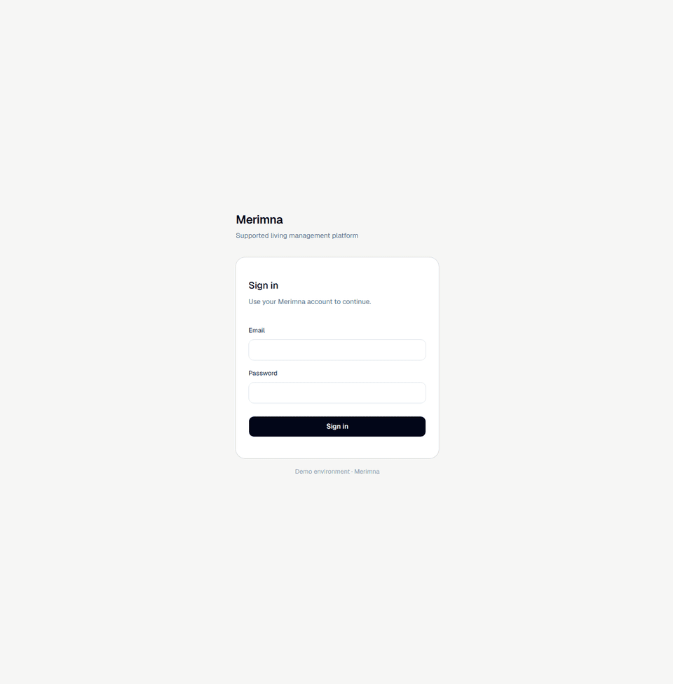

# Merimna — Supported Living Management Platform

## Overview

In supported living environments, important information about residents, staff responsibilities, house units, and
care-related records can become scattered across paper forms, shared folders, spreadsheets, and informal communication.
That can create gaps in accountability, consistency, and access control.

Inspired by real supported living workflows, **Merimna** is a full-stack management platform
for care operations: employee management, house-unit responsibilities, temporary coverage,
resident records, and audit history for sensitive changes.

## Preview

> Work in progress — the frontend is actively being refined.

### Admin employee workflow

A short preview of the current admin flow: authentication, employee listing, Greek-aware search, and employee detail
context.

<div style="text-align: center;">
  
</div>

## Key Features

### Product workflows

- **Employee management:** Admin workflow for listing, filtering, viewing, terminating, and reactivating employees.
- **House-unit responsibilities:** Employees are assigned to house units, defining their normal area of responsibility.
- **Temporary coverage:** Placements allow employees to temporarily work in another house unit without changing their
  official assignment.
- **Resident records:** Beneficiary information and related care records are managed with house-unit-aware access rules.
- **Audit history:** Important changes are recorded as structured audit events.

### Access control & security

- **JWT authentication:** Short-lived access tokens with rotating, database-backed opaque refresh tokens, HttpOnly
  cookie support, logout invalidation, and reuse detection.
- **Role-based authorization:** Permissions control access to employee, beneficiary, assignment, placement, user, and
  reference-data workflows.
- **Placement-aware access:** Active placements temporarily extend what an employee can access.
- **Account lifecycle:** User accounts are linked to employees and follow employee status changes, such as automatic
  deactivation on termination.

### Technical foundations

- **Spring Boot REST API:** Backend built around service-layer workflows and clear domain boundaries.
- **Domain-focused workflows:** Important lifecycle actions, such as beneficiary discharge and employee termination, are
  modeled through dedicated domain methods instead of simple field updates.
- **Assignment & placement validation:** Repository-level overlap checks prevent invalid date ranges and conflicting
  active assignments or placements.
- **PostgreSQL + Flyway:** Database schema changes are versioned through migrations.
- **Validation & error handling:** Custom validation rules with domain and validation errors mapped centrally to
  predictable response payloads and stable error codes.
- **Greek-aware search:** Accent-insensitive and case-insensitive search for Greek names, including `σ` / `ς`
  normalization.
- **OpenAPI integration:** API docs and generated frontend TypeScript types keep frontend/backend contracts aligned.

## Architecture Notes

- **Refresh token lifecycle:** Refresh tokens are stored as opaque database-backed tokens and rotated on use. Logout
  invalidates the submitted refresh token.
- **Token revocation:** Password changes, password resets, and refresh token reuse detection revoke all active refresh
  tokens for the affected user.
- **Browser and API clients:** Browser clients use HttpOnly cookies for refresh tokens, while non-browser clients can
  receive tokens in the response body.
- **Placement-aware scope resolution:** Employee access is resolved at runtime from active assignments and temporary
  placements, so coverage changes can affect access without changing the employee's official house-unit assignment.
- **Audit event structure:** Important domain and security-sensitive actions are captured through application events and
  persisted as structured audit records, keeping audit concerns outside the main service logic.

## Development Context

As the project evolves, [ADRs](docs/adr) are used to document important design
decisions and trade-offs.

Planned features, technical debt, and refactoring tasks are tracked
through [GitHub Issues](https://github.com/amichailides/merimna/issues)
to keep the development workflow structured and the project's evolution visible.

## Technical Stack

### Backend

- **Language:** Java 21
- **Framework:** Spring Boot 4.x
- **Security:** Spring Security 7.x, JWT, Argon2 password hashing
- **Data persistence:** Spring Data JPA, PostgreSQL, Flyway
- **Validation:** Jakarta Bean Validation / Hibernate Validator
- **API documentation:** Springdoc OpenAPI
- **Build tool:** Maven

### Frontend

- **Framework:** React
- **Language:** TypeScript
- **Build tool:** Vite
- **Styling:** Tailwind CSS, shadcn/ui
- **State management:** Zustand
- **Data fetching:** TanStack Query
- **Forms & validation:** React Hook Form, Zod
- **HTTP client:** Axios
- **API types:** OpenAPI-generated TypeScript types

### Development & runtime

- **Containerization:** Docker, Docker Compose

## API Overview

The API covers core supported-living workflows, including beneficiary management, employee administration, assignments,
temporary placements, user accounts, and supporting reference data.

### Authentication

- **POST** `/api/auth/login`
- **POST** `/api/auth/refresh`
- **POST** `/api/auth/logout`
- **POST** `/api/auth/forgot-password`
- **POST** `/api/auth/reset-password`

### Beneficiaries

- **GET** `/api/beneficiaries`
- **POST** `/api/beneficiaries`
- **GET** `/api/beneficiaries/{publicId}`
- **PATCH** `/api/beneficiaries/{publicId}`
- **PATCH** `/api/beneficiaries/{publicId}/house-unit/{houseUnitPublicId}`
- **POST** `/api/beneficiaries/{publicId}/discharge`

**Related beneficiary resources:**

- `/api/beneficiaries/{beneficiaryPublicId}/allergies`
- `/api/beneficiaries/{beneficiaryPublicId}/medications`
- `/api/beneficiaries/{beneficiaryPublicId}/legal-representatives/{legalRepresentativePublicId}`

### Employees

- **GET** `/api/employees`
- **POST** `/api/employees`
- **GET** `/api/employees/{publicId}`
- **PATCH** `/api/employees/{publicId}`
- **POST** `/api/employees/{publicId}/terminate`
- **POST** `/api/employees/{publicId}/reactivate`

### Employee Activity

- **GET** `/api/employees/{employeePublicId}/activity`

### Employee Assignments

- **GET** `/api/employees/{employeePublicId}/assignments`
- **POST** `/api/employees/{employeePublicId}/assignments`
- **GET** `/api/employees/{employeePublicId}/assignments/{assignmentPublicId}`
- **POST** `/api/employees/{employeePublicId}/assignments/{assignmentPublicId}/cancel`
- **POST** `/api/employees/{employeePublicId}/assignments/{assignmentPublicId}/terminate`

### Placements

- **GET** `/api/placements`
- **POST** `/api/placements`
- **GET** `/api/placements/{publicId}`
- **POST** `/api/placements/{publicId}/terminate`

### Users

- **GET** `/api/users`
- **POST** `/api/users`
- **GET** `/api/users/{publicId}`
- **PATCH** `/api/users/{publicId}`
- **GET** `/api/users/me`
- **PATCH** `/api/users/me/password`

### Reference data & supporting resources

Standard CRUD operations are available for:

- `/api/legal-representatives`
- `/api/house-units`
- `/api/employee-positions`

## API Documentation

After starting the application locally, API documentation is available at:

- `/api/v3/api-docs` — OpenAPI specification
- `/api/scalar` — interactive API UI

## Development Setup

### Prerequisites

- **Docker & Docker Compose**

### Run Locally

1. **Clone the repository:**

```bash
git clone https://github.com/amichailides/merimna.git
cd merimna
```

2. **Start the application:**

```bash
docker compose up -d --build
```

3. **Load demo data:**

```bash
docker compose exec -T postgres psql -U merimna_user -d merimna_db < dev/demo-data.sql
```

4. **Sign in with the demo admin account:**

```text
Email: admin@merimna.local
Password: admin123
```

The backend API will be available at:

```text
http://localhost:8080
```

The frontend will be available at:

```text
http://localhost:5173
```

API documentation is available at:

```text
http://localhost:8080/api/scalar
```

## Future Vision

- **Care activity records:** Add staff-facing forms for recording beneficiary care activities, incidents, and daily notes.
- **Assignments and placements UI:** Expand the frontend with dedicated screens for managing assignment and placement lifecycles.
- **Beneficiary management UI:** Build the frontend workflow for resident records and related care information.
- **Authorization testing:** Expand integration tests for placement-aware access control and other critical security flows.
- **Audit expansion:** Extend audit coverage and activity views to more domain events and sensitive data operations.
- **Admin dashboard:** Add operational summaries, recent events, and follow-up tasks for administrators.
