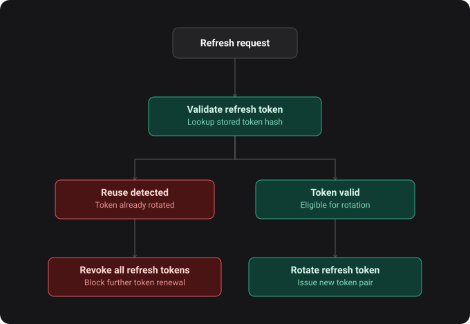
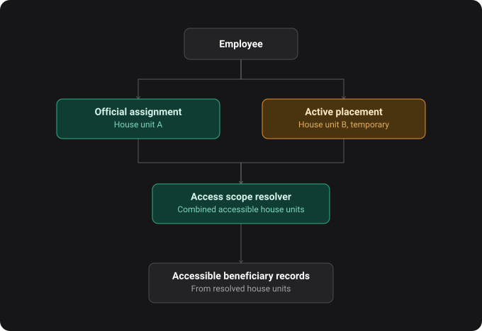

# Merimna — Supported Living Management Platform

[Live Application](https://merimna.care)
·
[Interactive API Documentation](https://api.merimna.care/api/scalar)
·
[Architecture Decisions](docs/adr)
·
[GitHub Issues](https://github.com/amichailides/merimna/issues)

## Overview

Supported living operations often depend on paper records, spreadsheets, and informal
communication — making staff responsibilities, access boundaries, and sensitive changes
hard to track consistently.

**Merimna** is a full-stack management platform that brings these workflows into one place:
employee responsibilities, house-unit assignments, temporary staff placements, beneficiary
records, user access, and structured audit history for important changes.

## Preview

> The deployed frontend currently focuses on the main administrative workflows, while the backend API supports a broader set of supported-living operations.

### Admin workspace

Dashboard overview, employee management, beneficiary management, and supporting reference views.

<p align="center">
  
</p>

## Key Features

### Product capabilities

- **Employee management:** List, filter, view, terminate, and reactivate employees.
- **House-unit assignments:** Define each employee's normal area of responsibility.
- **Temporary placements:** Allow employees to work temporarily in another house unit without changing their official
  assignment.
- **Beneficiary records:** Manage beneficiary information and related care records with house-unit-aware access.
- **Audit history:** Record important operational and security-sensitive changes as structured events.

### Security & access control

- **Refresh-token rotation:** Database-backed opaque refresh tokens with reuse detection, logout invalidation, and
  HttpOnly cookie support.
- **Granular permissions:** Control access across employee, beneficiary, assignment, placement, user, and reference-data
  workflows.
- **Placement-aware access:** Active placements temporarily extend an employee's accessible house units.
- **Account lifecycle:** Employee termination automatically deactivates the linked user account.

### Technical foundations

- **Spring Boot REST API:** Backend built around service-layer workflows and clear domain boundaries.
- **Domain-focused workflows:** Important lifecycle actions, such as beneficiary discharge and employee termination, are
  modeled through dedicated domain methods instead of simple field updates.
- **Assignment & placement validation:** Repository-level overlap checks prevent invalid date ranges and conflicting
  active assignments or placements.
- **PostgreSQL + Flyway:** Database schema changes are versioned through migrations.
- **Validation & error handling:** Custom validation rules with domain and validation errors mapped centrally to
  predictable response payloads and stable error codes.
- **Greek-aware search:** Accent-insensitive and case-insensitive search for Greek names, including `σ` / `ς`
  normalization.
- **OpenAPI integration:** API docs and generated frontend TypeScript types keep frontend/backend contracts aligned.

## Architecture Notes

- **Refresh token lifecycle:** Refresh tokens are stored as opaque database-backed tokens and rotated on use. Logout
  invalidates the submitted refresh token.
- **Token revocation:** Password changes, password resets, and refresh token reuse detection revoke all active refresh
  tokens for the affected user.
- **Browser and API clients:** Browser clients use HttpOnly cookies for refresh tokens, while non-browser clients can
  receive tokens in the response body.

The following flow shows how refresh-token rotation handles both valid renewal and suspected token reuse.

<p align="center">
  
</p>

- **Audit event structure:** Important domain and security-sensitive actions are captured through application events and
  persisted as structured audit records, keeping audit concerns outside the main service logic.
- **Placement-aware scope resolution:** Access is resolved at runtime from active assignments and temporary placements.
  Coverage can therefore extend access without changing the employee's official house-unit assignment.

The following flow shows how official assignments and active placements are combined to resolve accessible house units.

<p align="center">
  
</p>

## Development Context

As the project evolves, [ADRs](docs/adr) are used to document important design
decisions and trade-offs.

Planned features, technical debt, and refactoring tasks are tracked
through [GitHub Issues](https://github.com/amichailides/merimna/issues)
to keep the development workflow structured and the project's evolution visible.

## Technical Stack


### Backend

- **Language:** Java 21
- **Framework:** Spring Boot 4.x
- **Security:** Spring Security 7.x, JWT, Argon2 password hashing
- **Data persistence:** Spring Data JPA, PostgreSQL 17, Flyway
- **Validation:** Jakarta Bean Validation / Hibernate Validator
- **API documentation:** Springdoc OpenAPI
- **Build tool:** Maven

### Frontend

- **Framework:** React 19
- **Language:** TypeScript 5.9
- **Build tool:** Vite
- **Styling:** Tailwind CSS, shadcn/ui
- **State management:** Zustand
- **Forms & validation:** React Hook Form, Zod
- **HTTP client:** Axios
- **API types:** OpenAPI-generated TypeScript types

### Development & runtime

- **Containerization:** Docker, Docker Compose

## API Overview

The REST API currently covers:

- Authentication, invitations, and refresh-token lifecycle
- Employee administration, system access, and lifecycle actions
- Employee assignments and temporary placements
- Beneficiary records, allergies, medications, and legal representatives
- User accounts and password management
- House units, employee positions, and supporting reference data
- Admin dashboard summaries and employee activity

Explore the complete API through the
[interactive Scalar documentation](https://api.merimna.care/api/scalar).

<details>
<summary>View endpoint list</summary>

### Authentication

- **POST** `/api/auth/login`
- **POST** `/api/auth/refresh`
- **POST** `/api/auth/logout`
- **POST** `/api/auth/forgot-password`
- **POST** `/api/auth/reset-password`
- **POST** `/api/auth/accept-invitation`

### Dashboard

- **GET** `/api/dashboard/admin`

### Beneficiaries

- **GET** `/api/beneficiaries`
- **POST** `/api/beneficiaries`
- **GET** `/api/beneficiaries/{beneficiaryPublicId}`
- **PATCH** `/api/beneficiaries/{beneficiaryPublicId}`
- **POST** `/api/beneficiaries/{beneficiaryPublicId}/discharge`
- **PATCH** `/api/beneficiaries/{beneficiaryPublicId}/house-unit/{houseUnitPublicId}`

### Beneficiary Allergies

- **GET** `/api/beneficiaries/{beneficiaryPublicId}/allergies`
- **POST** `/api/beneficiaries/{beneficiaryPublicId}/allergies`
- **GET** `/api/beneficiaries/{beneficiaryPublicId}/allergies/{allergyPublicId}`
- **PATCH** `/api/beneficiaries/{beneficiaryPublicId}/allergies/{allergyPublicId}`
- **DELETE** `/api/beneficiaries/{beneficiaryPublicId}/allergies/{allergyPublicId}`

### Beneficiary Medications

- **GET** `/api/beneficiaries/{beneficiaryPublicId}/medications`
- **POST** `/api/beneficiaries/{beneficiaryPublicId}/medications`
- **GET** `/api/beneficiaries/{beneficiaryPublicId}/medications/{medicationPublicId}`
- **PATCH** `/api/beneficiaries/{beneficiaryPublicId}/medications/{medicationPublicId}`
- **POST** `/api/beneficiaries/{beneficiaryPublicId}/medications/{medicationPublicId}/discontinue`

### Beneficiary Legal Representatives

- **POST** `/api/beneficiaries/{beneficiaryPublicId}/legal-representatives/{legalRepresentativeId}`
- **DELETE** `/api/beneficiaries/{beneficiaryPublicId}/legal-representatives/{legalRepresentativeId}`

### Employees

- **GET** `/api/employees`
- **POST** `/api/employees`
- **POST** `/api/employees/onboarding`
- **GET** `/api/employees/{employeePublicId}`
- **PATCH** `/api/employees/{employeePublicId}`
- **GET** `/api/employees/{employeePublicId}/activity`
- **POST** `/api/employees/{employeePublicId}/terminate`
- **POST** `/api/employees/{employeePublicId}/reactivate`

### Employee Access

- **GET** `/api/employees/{employeePublicId}/access`
- **POST** `/api/employees/{employeePublicId}/access`
- **POST** `/api/employees/{employeePublicId}/access/invitation/resend`
- **DELETE** `/api/employees/{employeePublicId}/access/invitation`

### Employee Assignments

- **GET** `/api/employees/{employeePublicId}/assignments`
- **POST** `/api/employees/{employeePublicId}/assignments`
- **GET** `/api/employees/{employeePublicId}/assignments/{assignmentPublicId}`
- **POST** `/api/employees/{employeePublicId}/assignments/{assignmentPublicId}/cancel`
- **POST** `/api/employees/{employeePublicId}/assignments/{assignmentPublicId}/terminate`

### Placements

- **GET** `/api/placements`
- **POST** `/api/placements`
- **GET** `/api/placements/{placementPublicId}`
- **POST** `/api/placements/{placementPublicId}/terminate`

### Users

- **GET** `/api/users`
- **POST** `/api/users`
- **GET** `/api/users/{publicId}`
- **PATCH** `/api/users/{publicId}`
- **GET** `/api/users/me`
- **PATCH** `/api/users/me/password`

### House Units

- **GET** `/api/house-units`
- **POST** `/api/house-units`
- **GET** `/api/house-units/{houseUnitPublicId}`
- **PATCH** `/api/house-units/{houseUnitPublicId}`

### Employee Positions

- **GET** `/api/employee-positions`
- **POST** `/api/employee-positions`

### Legal Representatives

- **POST** `/api/legal-representatives`
- **GET** `/api/legal-representatives/{legalRepresentativeId}`
- **PATCH** `/api/legal-representatives/{legalRepresentativeId}`

</details>

## Development Setup

### Prerequisites

- **Docker & Docker Compose**

### Run Locally

1. **Clone the repository:**

```bash
git clone https://github.com/amichailides/merimna.git
cd merimna
```

2. **Start the full local stack:**

```bash
docker compose up -d --build
```

This starts:

- PostgreSQL
- Spring Boot backend
- React frontend
- Demo data loader (one-shot service)

The database schema is created through Flyway migrations, and the demo dataset is loaded automatically once the migrations complete.

The demo data loader exits successfully after seeding the database, so `Exited (0)` is the expected status.

3. **Sign in with the demo admin account:**

```text
Email: admin@merimna.local
Password: admin123
```

### Local URLs

- **Frontend:** `http://localhost:5173`
- **Backend API:** `http://localhost:8080/api`
- **OpenAPI specification:** `http://localhost:8080/api/v3/api-docs`
- **Interactive API documentation:** `http://localhost:8080/api/scalar`

## Testing

Backend tests use JUnit and Mockito.

On Linux, macOS, or Git Bash:

```bash
cd backend
./mvnw test
```

On Windows PowerShell:

```powershell
cd backend
.\mvnw.cmd test
```

## Deployment

The live application is deployed using:

- **Frontend:** Vercel
- **Backend & database:** Railway (Spring Boot API + PostgreSQL)
- **Domain & edge security:** Cloudflare

The frontend communicates with the backend through the public REST API at `api.merimna.care`.

## Future Vision

- **Care activity records:** Add staff-facing forms for recording beneficiary care activities, incidents, and daily notes.
- **Assignments and placements UI:** Replace the current placeholder pages with full lifecycle management workflows.
- **Beneficiary care workflows:** Expand frontend support for allergies, medications, legal representatives, and other related beneficiary records.
- **Authorization testing:** Expand integration coverage for placement-aware access and other critical security flows.
- **Centralized audit view:** Add an admin-facing page for reviewing domain and security events across the system, with filters for event type, subject, and date.
- **Dashboard expansion:** Extend the admin dashboard with additional operational summaries and follow-up views.
